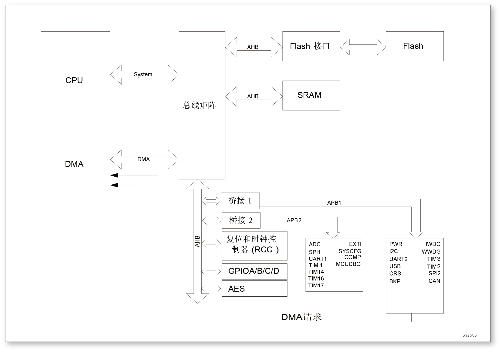

存储器和总线架构
================

系统描述
--------

主系统由以下部分构成：

- 两个驱动单元：
    - CPU 内核系统总线 (S-bus)
    - 通用 DMA
- 三个被动单元：
    - 内部 SRAM
    - 内部闪存存储器 
    - AHB 到 APB 的桥 (APBx)，它连接所有的 AHB 设备

这些都是通过一个多级的AHB总线构架相互连接的，如所示：

    系统架构

系统总线
^^^^^^^^

此总线连接 CPU 内核的系统总线(外设总线)到总线矩阵，总线矩阵协调着内核和 DMA 间的访问。

DMA总线
^^^^^^^

此总线将 DMA 的 AHB 主控接口与总线矩阵相联，总线矩阵协调 CPU 和 DMA 到 SRAM、闪存和外设的访问控制。

总线矩阵(BusMatrix)
^^^^^^^^^^^^^^^^^^^

总线矩阵管理着内核系统总线与DMA总线的访问仲裁，总线矩阵由主模块总线及从模块总线组成。

AHB 外设通过总线矩阵与系统总线相连，允许DMA访问。

AHB 到 APB 桥 (AHB2APB bridges - APB)
^^^^^^^^^^^^^^^^^^^^^^^^^^^^^^^^^^^^^

AHB 到 APB 桥在 AHB 与 APB 总线间提供同步连接。在每次复位之后，所有的外设时钟都关闭(除了 SRAM 及 Flash 外)。在用一个外设前，你必须打开相应的 RCC_AHBENR、RCC_APB2ENR 或 RCC_APB1ENR 寄存器中时钟使能位。

.. Attention:: 当对APB寄存器进行 8 位或者 16 位访问时，该访问会被自动转换成32位的访问：桥会自动将16位或者8位的数据扩展以配合 32 位的宽度。

存储器组织
----------

介绍
^^^^

程序存储器，数据存储器，寄存器及 I/O 口统一编址，其线性地址空间达到4G。

数据字节以小端格式存放在存储器中，一个字里的最低地址字节被认为是该字的最低有效字节，而最高地址字节是最高有效字节。

寻址空间分成 8 块，每块 512MB。其他所有没有分配给片上存储器和外设的存储器空间都是保留的地址空间。详细请参考存储器映像和寄存器编址章节和外设章节。

存储器映像和寄存器编址
^^^^^^^^^^^^^^^^^^^^^^

存储器映像请参考各外设对应章节中的存储器映像图。

下表给出了所有内置外设的起始地址。

+------------------------+---------------------------+----------------------+-------------------------------+-------------+
| 总线                   | 编制范围                  | 大小                 | 外设                          | 备注        |
+========================+===========================+======================+===============================+=============+
|Flash                   | 0x0000 0000 – 0x0001 FFFF | 128 KB               | 主闪存存储器                  |             |
+                        +---------------------------+----------------------+-------------------------------+-------------+
|                        | 0x0002 0000 – 0x07FF FFFF | ~ 128 MB             | Reserved                      |             |
+                        +---------------------------+----------------------+-------------------------------+-------------+
|                        | 0x0800 0000 – 0x0801 FFFF | 128 KB               | Main Flash memory             |             |
+                        +---------------------------+----------------------+-------------------------------+-------------+
|                        | 0x0802 0000 – 0x 1FFDFFFF | ~ 256 MB             | Reserved                      |             |
+                        +---------------------------+----------------------+-------------------------------+-------------+
|                        | 0x1FFE 0000 – 0x1FFE 01FF | 0.5 KB               | Reserved                      |             |
+                        +---------------------------+----------------------+-------------------------------+-------------+
|                        | 0x1FFE 0200 – 0x1FFE 0FFF | 3 KB                 | Reserved                      |             |
+                        +---------------------------+----------------------+-------------------------------+-------------+
|                        | 0x1FFE 1000 – 0x1FFE 1BFF | 3 KB                 | Reserved                      |             |
+                        +---------------------------+----------------------+-------------------------------+-------------+
|                        | 0x1FFE 1C00 – 0x1FFF F3FF | ~ 256 MB             | Reserved                      |             |
+                        +---------------------------+----------------------+-------------------------------+-------------+
|                        | 0x1FFF F400 – 0x1FFF F7FF | 1 KB                 | System memory                 |             |
+                        +---------------------------+----------------------+-------------------------------+-------------+
|                        | 0x1FFF F800 – 0x1FFF F80F | 16 B                 | Option bytes                  |             |
+                        +---------------------------+----------------------+-------------------------------+-------------+
|                        | 0x1FFF F810 – 0x1FFF FFFF | ~2 KB                | Reserved                      |             |
+------------------------+---------------------------+----------------------+-------------------------------+-------------+
| SRAM                   | 0x2000 0000 – 0x2000 1FFF | 8 KB                 | SRAM                          |             |
+                        +---------------------------+----------------------+-------------------------------+-------------+
|                        | 0x2000 2000 – 0x2FFF FFFF | ~ 512 MB             | Reserved                      |             |
+------------------------+---------------------------+----------------------+-------------------------------+-------------+
| APB1                   | 0x4000 0000 – 0x4000 03FF | 1 KB                 | TIM2                          |             |
+                        +---------------------------+----------------------+-------------------------------+-------------+
|                        | 0x4000 0400 – 0x4000 07FF | 1 KB                 | TIM3                          |             |
+                        +---------------------------+----------------------+-------------------------------+-------------+
|                        | 0x4000 0800 – 0x4000 0BFF | 8 KB                 | Reserved                      |             |
+                        +---------------------------+----------------------+-------------------------------+-------------+
|                        | 0x4000 2800 – 0x4000 2BFF | 1 KB                 | BKP                           |             |
+                        +---------------------------+----------------------+-------------------------------+-------------+
|                        | 0x4000 2C00 – 0x4000 2FFF | 1 KB                 | WWDG                          |             |
+                        +---------------------------+----------------------+-------------------------------+-------------+
|                        | 0x4000 3000 – 0x4000 33FF | 1 KB                 | IWDG                          |             |
+                        +---------------------------+----------------------+-------------------------------+-------------+
|                        | 0x4000 3400 – 0x4000 37FF | 1 KB                 | Reserved                      |             |
+                        +---------------------------+----------------------+-------------------------------+-------------+
|                        | 0x4000 3800 – 0x4000 3BFF | 1 KB                 | SPI2                          |             |
+                        +---------------------------+----------------------+-------------------------------+-------------+
|                        | 0x4000 4000 – 0x4000 43FF | 1 KB                 | Reserved                      |             |
+                        +---------------------------+----------------------+-------------------------------+-------------+
|                        | 0x4000 4400 – 0x4000 47FF | 1 KB                 | UART2                         |             |
+                        +---------------------------+----------------------+-------------------------------+-------------+
|                        | 0x4000 4800 – 0x4000 4BFF | 3 KB                 | Reserved                      |             |
+                        +---------------------------+----------------------+-------------------------------+-------------+
|                        | 0x4000 5400 – 0x4000 57FF | 1 KB                 | I2C                           |             |
+                        +---------------------------+----------------------+-------------------------------+-------------+
|                        | 0x4000 5800 – 0x4000 5BFF | 1 KB                 | Reserved                      |             |
+                        +---------------------------+----------------------+-------------------------------+-------------+
|                        | 0x4000 5C00 – 0x4000 5FFF | 1 KB                 | USB                           |             |
+                        +---------------------------+----------------------+-------------------------------+-------------+
|                        | 0x4000 6000 – 0x4000 63FF | 1 KB                 | Reserved                      |             |
+                        +---------------------------+----------------------+-------------------------------+-------------+
|                        | 0x4000 6400 – 0x4000 67FF | 1 KB                 | CAN                           |             |
+                        +---------------------------+----------------------+-------------------------------+-------------+
|                        | 0x4000 6800 – 0x4000 6BFF | 1 KB                 | Reserved                      |             |
+                        +---------------------------+----------------------+-------------------------------+-------------+
|                        | 0x4000 6C00 – 0x4000 6FFF | 1 KB                 | CRS                           |             |
+                        +---------------------------+----------------------+-------------------------------+-------------+
|                        | 0x4000 7000 – 0x4000 73FF | 1 KB                 | PWR                           |             |
+                        +---------------------------+----------------------+-------------------------------+-------------+
|                        | 0x4000 7400 – 0x4000 FFFF | 35 KB                | Reserved                      |             |
+------------------------+---------------------------+----------------------+-------------------------------+-------------+
| APB2                   | 0x4001 0000 – 0x4001 03FF | 1 KB                 | SYSCFG                        |             |
+                        +---------------------------+----------------------+-------------------------------+-------------+
|                        | 0x4001 0400 – 0x4001 07FF | 1 KB                 | EXTI                          |             |
+                        +---------------------------+----------------------+-------------------------------+-------------+
|                        | 0x4001 0800 – 0x4001 23FF | 7 KB                 | Reserved                      |             |
+                        +---------------------------+----------------------+-------------------------------+-------------+
|                        | 0x4001 2400 – 0x4001 27FF | 1 KB                 | ADC                           |             |
+                        +---------------------------+----------------------+-------------------------------+-------------+
|                        | 0x4001 2800 – 0x4001 2BFF | 1 KB                 | Reserved                      |             |
+                        +---------------------------+----------------------+-------------------------------+-------------+
|                        | 0x4001 2C00 – 0x4001 2FFF | 1 KB                 | TIM1                          |             |
+                        +---------------------------+----------------------+-------------------------------+-------------+
|                        | 0x4001 3000 – 0x4001 33FF | 1 KB                 | SPI1                          |             |
+                        +---------------------------+----------------------+-------------------------------+-------------+
|                        | 0x4001 3400 – 0x4001 37FF | 1 KB                 | DBGMCU                        |             |
+                        +---------------------------+----------------------+-------------------------------+-------------+
|                        | 0x4001 3800 – 0x4001 3BFF | 1 KB                 | UART1                         |             |
+                        +---------------------------+----------------------+-------------------------------+-------------+
|                        | 0x4001 3C00 – 0x4001 3FFF | 1 KB                 | COMP                          |             |
+                        +---------------------------+----------------------+-------------------------------+-------------+
|                        | 0x4001 4000 – 0x4001 43FF | 1 KB                 | TIM14                         |             |
+                        +---------------------------+----------------------+-------------------------------+-------------+
|                        | 0x4001 4400 – 0x4001 47FF | 1 KB                 | TIM16                         |             |
+                        +---------------------------+----------------------+-------------------------------+-------------+
|                        | 0x4001 4800 – 0x4001 4BFF | 1 KB                 | TIM17                         |             |
+                        +---------------------------+----------------------+-------------------------------+-------------+
|                        | 0x4001 4C00 – 0x4001 7FFF | 13 KB                | Reserved                      |             |
+------------------------+---------------------------+----------------------+-------------------------------+-------------+
| AHB                    | 0x4002 0000 – 0x4002 03FF | 1 KB                 | DMA                           |             |
+                        +---------------------------+----------------------+-------------------------------+-------------+
|                        | 0x4002 0400 – 0x4002 0FFF | 3 KB                 | Reserved                      |             |
+                        +---------------------------+----------------------+-------------------------------+-------------+
|                        | 0x4002 1000 – 0x4002 13FF | 1 KB                 | RCC                           |             |
+                        +---------------------------+----------------------+-------------------------------+-------------+
|                        | 0x4002 1400 – 0x4002 1FFF | 3 KB                 | Reserved                      |             |
+                        +---------------------------+----------------------+-------------------------------+-------------+
|                        | 0x4002 2000 – 0x4002 23FF | 1 KB                 | Flash 接口                    |             |
+                        +---------------------------+----------------------+-------------------------------+-------------+
|                        | 0x4002 2400 – 0x4002 5FFF | 15 KB                | Reserved                      |             |
+                        +---------------------------+----------------------+-------------------------------+-------------+
|                        | 0x4002 6000 – 0x4002 63FF | 1 KB                 | AES                           |             |
+                        +---------------------------+----------------------+-------------------------------+-------------+
|                        | 0x4002 6400 – 0x47FF FFFF | ~ 128 MB             | Reserved                      |             |
+                        +---------------------------+----------------------+-------------------------------+-------------+
|                        | 0x4800 0000 – 0x4800 03FF | 1 KB                 | GPIOA                         |             |
+                        +---------------------------+----------------------+-------------------------------+-------------+
|                        | 0x4800 0400 – 0x4800 07FF | 1 KB                 | GPIOB                         |             |
+                        +---------------------------+----------------------+-------------------------------+-------------+
|                        | 0x4800 0800 – 0x4800 0BFF | 1 KB                 | GPIOC                         |             |
+                        +---------------------------+----------------------+-------------------------------+-------------+
|                        | 0x4800 0C00 – 0x4800 0FFF | 1 KB                 | GPIOD                         |             |
+                        +---------------------------+----------------------+-------------------------------+-------------+
|                        | 0x4800 1000 – 0x5FFF FFFF | ~ 384 MB             | Reserved                      |             |
+------------------------+---------------------------+----------------------+-------------------------------+-------------+

内置的 SRAM
-----------

内置最大可到 8K 字节的 SRAM。

它可以以字节 (8位)、半字 (16位) 或字 (32位) 进行访问。SRAM起始地址为 0x2000 0000。

闪存存储器概述
--------------

闪存存储器有两个不同存储区域：

- 主闪存存储块，它包括应用程序和用户数据区(若需要时)
- 信息块，其包含四个部分：
    - 选项字节 (Option bytes) － 内含硬件及存储保护用户配置选项。
    - 系统存储器 (System memory) － 其包含 boot loader 代码。参见内置闪存存储器章节。

闪存接口基于AHB协议执行指令和数据存取。其预取缓冲的功能可加速CPU执行代码的速度。

启动配置 (Boot configuration)
-----------------------------

可通过 BOOT0 及 BOOT1 脚的配置选择三种不同的启动模式，如下表所示。

+---------------+--------------+--------------------------+
| 启动模式选择  | 启动模式     | 说明                     |
+-------+-------+              +                          +
| BOOT1 | BOOT0 |              |                          |
+=======+=======+==============+==========================+
| x     | 0     | 主闪存存储器 | 主闪存存储器选为启动区域 |
+-------+-------+--------------+--------------------------+
| 1     | 1     | 系统存储器   | 系统存储器选为启动区域   |
+-------+-------+--------------+--------------------------+
| 0     | 1     | 内置 SRAM    | 内置 SRAM 选为启动区域   |
+-------+-------+--------------+--------------------------+

器件复位后，在 SYSCLK 的第 4 个上升沿锁存 BOOT0 和 BOOT1 的引脚值，用户可通过设置 BOOT1 和  BOOT0 来选择启动模式。

从待机模式唤醒时，CPU 会得新采样 BOOT0 及 BOOT1 的引脚值，因此在有待机应用的场合需要保持启动模式的设置。

在启动延迟之后，CPU 从地址 0x0000 0000 获取堆栈顶的地址，并从启动存储器的 0x0000 0004 指示的地址开始执行代码。

根据选定的启动模式，主闪存存储器，系统存储器或 SRAM 按照以下的说明访问：

- 从主闪存存储器启动：主闪存存储器被映射到启动存储空间 (0x0000 0000)，但仍然能从原有的地址空间 (0x0800 0000) 访问。即闪存存储器的内容可从两个地址开始访问，0x0000 0000 或 0x0800 0000。
- 从系统存储器启动：系统存储器被映射到启动空间 (0x0000 0000)，但仍然能够在它原有的地址空间 (0x1FFF F400) 访问。
- 从内置的 SRAM 启动：SRAM 映射到启动空间 (0x0000 0000)，但其仍然能够在它原有的地址空间 (0x2000 0000) 访问。

内嵌的自举程序
^^^^^^^^^^^^^^

内嵌的自举程序存放在系统存储器，由厂家在生产时写入。该程序可以通过 UART1 对闪存进行重新编程。