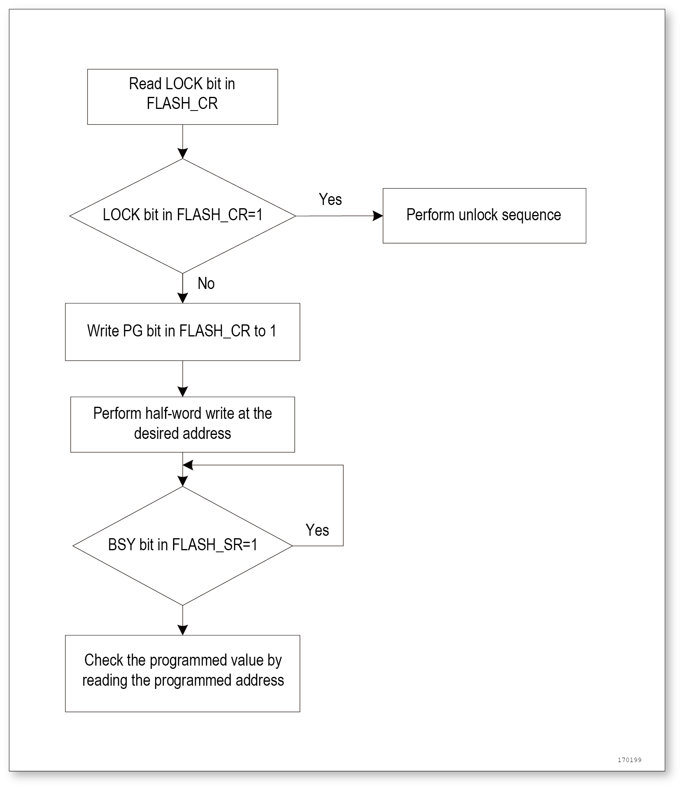
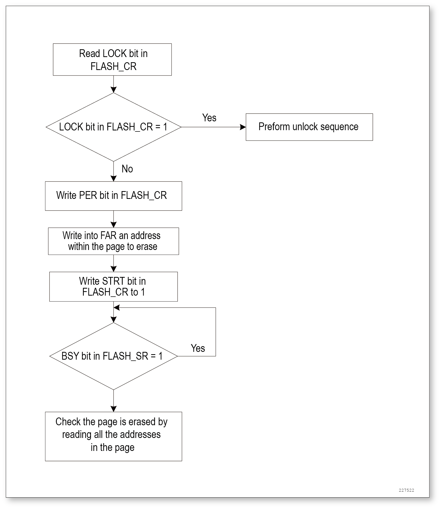
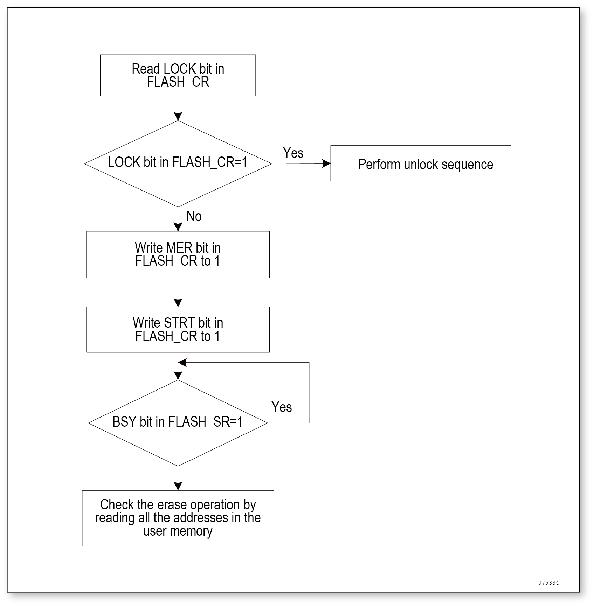
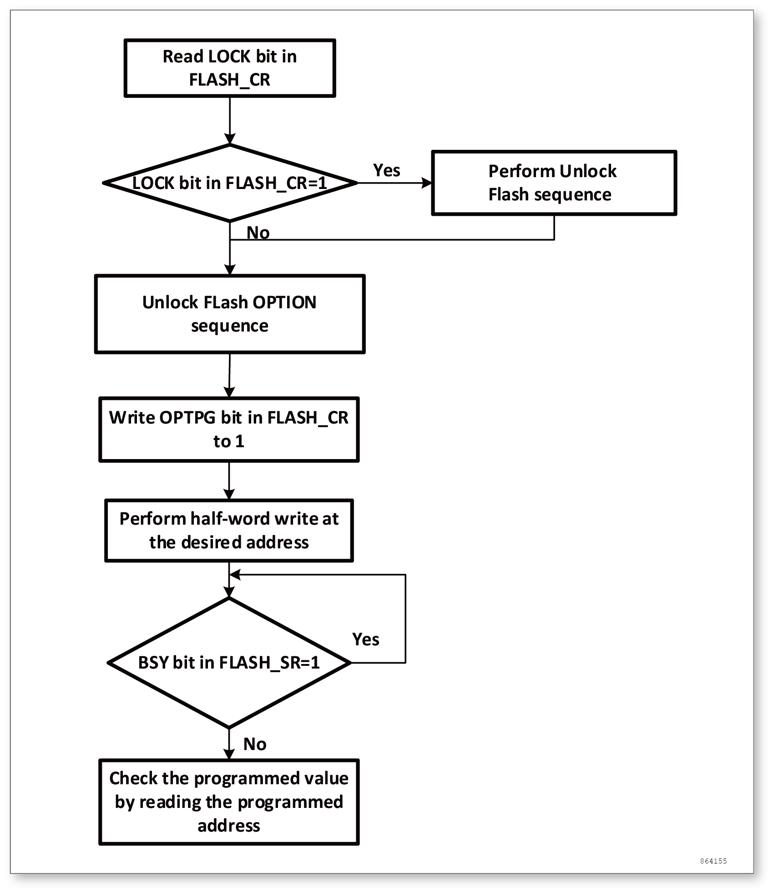
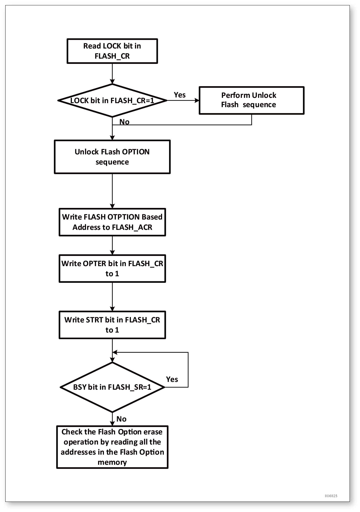

嵌入式闪存（FLASH）
===================

闪存主要特征
------------

高达 64K 字节闪存存储器。

闪存接口的特性为：

- 带预取缓冲器的数据接口(每字为 2 × 64 位 )
- 选择字节加载器
- 闪存编程/擦除操作
- 访问/写保护
- 低功耗模式

闪存功能描述
------------

闪存结构
^^^^^^^^

闪存空间由 64 位宽的存储单元组成，既可以存代码又可以存数据。主闪存块按 128 页(每页 1K 字节)或 32 扇区(每扇区 4K 字节)分块，以扇区为单位设置写保护(参见存储保护相关内容)。

+----------------------+---------------+---------------------------+--------------+
| 模块                 | 名称          | 地址                      | 大小（字节） |
+======================+===============+===========================+==============+
| 主存储块             | 页0           | 0x0800 0000 - 0x0800 03FF | 1K           |
+                      +---------------+---------------------------+--------------+
|                      | 页1           | 0x0800 0400 - 0x0800 07FF | 1K           |
+                      +---------------+---------------------------+--------------+
|                      | 页2           | 0x0800 0800 - 0x0800 0BFF | 1K           |
+                      +---------------+---------------------------+--------------+
|                      | 页3           | 0x0800 0C00 - 0x0800 0FFF | 1K           |
+                      +---------------+---------------------------+--------------+
|                      | ...           |  ...                      | ...          |
+                      +---------------+---------------------------+--------------+
|                      | ...           |  ...                      | ...          |
+                      +---------------+---------------------------+--------------+
|                      | 页28          | 0x0800 7000 - 0x0800 73FF | 1K           |
+                      +---------------+---------------------------+--------------+
|                      | 页29          | 0x0800 7400 - 0x0800 77FF | 1K           |
+                      +---------------+---------------------------+--------------+
|                      | 页30          | 0x0800 7800 - 0x0800 7BFF | 1K           |
+                      +---------------+---------------------------+--------------+
|                      | 页31          | 0x0800 7C00 - 0x0800 7FFF | 1K           |
+                      +---------------+---------------------------+--------------+
|                      | ...           |  ...                      | ...          |
+                      +---------------+---------------------------+--------------+
|                      | ...           |  ...                      | ...          |
+                      +---------------+---------------------------+--------------+
|                      | 页123         | 0x0801 EC00 - 0x0801 EFFF | 1K           |
+                      +---------------+---------------------------+--------------+
|                      | 页124         | 0x0801 F000 - 0x0801 F3FF | 1K           |
+                      +---------------+---------------------------+--------------+
|                      | 页125         | 0x0801 F400 - 0x0801 F7FF | 1K           |
+                      +---------------+---------------------------+--------------+
|                      | 页126         | 0x0801 F800 - 0x0801 FBFF | 1K           |
+                      +---------------+---------------------------+--------------+
|                      | 页127         | 0x0801 FC00 - 0x0801 FFFF | 1K           |
+----------------------+---------------+---------------------------+--------------+
| 信息块               | 保护字节      | 0x1FFE 0000 - 0x1FFE 01FF | 0.5K         |
+                      +---------------+---------------------------+--------------+
|                      | 保密空间      | 0x1FFE 1000 - 0x1FFE 1BFF | 3K           |
+                      +---------------+---------------------------+--------------+
|                      | 系统存储器    | 0x1FFF F400 - 0x1FFF F7FF | 1K           |
+                      +---------------+---------------------------+--------------+
|                      | 选项字节      | 0x1FFF F800 - 0x1FFF F80F | 16           |
+----------------------+---------------+---------------------------+--------------+
| 闪存存储器接口寄存器 | FLASH_ACR     | 0x4002 2000 - 0x4002 2003 | 4            |
+                      +---------------+---------------------------+--------------+
|                      | FLASH_KEYR    | 0x4002 2004 - 0x4002 2007 | 4            |
+                      +---------------+---------------------------+--------------+
|                      | FLASH_OPTKEYR | 0x4002 2008 - 0x4002 200B | 4            |
+                      +---------------+---------------------------+--------------+
|                      | FLASH_SR      | 0x4002 200C - 0x4002 200F | 4            |
+                      +---------------+---------------------------+--------------+
|                      | FLASH_CR      | 0x4002 2010 - 0x4002 2013 | 4            |
+                      +---------------+---------------------------+--------------+
|                      | FLASH_AR      | 0x4002 2014 - 0x4002 2017 | 4            |
+                      +---------------+---------------------------+--------------+
|                      | 保留          | 0x4002 2018 - 0x4002 201B | 4            |
+                      +---------------+---------------------------+--------------+
|                      | FLASH_OBR     | 0x4002 201C - 0x4002 201F | 4            |
+                      +---------------+---------------------------+--------------+
|                      | FLASH_WRPR    | 0x4002 2020 - 0x4002 2023 | 4            |
+----------------------+---------------+---------------------------+--------------+

FLASH 读操作
^^^^^^^^^^^^

嵌入式 Flash 模块可以像普遍存储空间一样直接寻址访问。任何对 Flash 模块内容的读操作都须经过专门的判断过程。

取指令和取数据都是通过 AHB 总线读取访问，能够按照 Flash 访问控制寄存器 (FLASH_ACR) 中得选项所指定的方式执行：

- 取指：预取值缓冲区使能后可提高 CPU 运行速度
- 潜伏期：等待位的个数，保证正确的读取。

取指
""""

CPU 通过 AHB 总线取指。预取指模块的功效在于提高取指效率。

预取缓冲区
""""""""""

预取缓冲区 ( 2 个 64 位)：在每一次复位以后被自动打开，由于每个缓冲区的大小 (64 位) 与闪存的带宽相同，因此只通过需一次读闪存的操作即可更新整个缓冲区的内容。由于预取缓冲区的存在，CPU 可以工作在更高的主频。CPU 每次取指最多为 32 位的字，取一条指令时，下一条指令已经在缓冲区中等待。

预取控制器
""""""""""

预取控制器会根据预取缓冲区的可用空间来把握访问 Flash 的时机。当预取缓冲区中存在至少一块可用空间时，预取控制器会发起一次读取请求。复位后，预取指缓冲区的默认状态是打开的。只有在 SYSCLK 低于24MHz，并且 AHB 时钟没有经过任何分频的条件下 (SYSCLK 必须等于 HCLK) 才可以开/关预取指缓冲区。通常情况下，预取指缓冲区在初始化过程中就已经决定好开关状态了，而当时MCU运行在内部 8MHz 的振荡器下。

.. Attention:: 当 AHB 时钟的预分频器不等于 1 时，预取指缓冲区必须打开访问潜伏期。

访问潜伏期
""""""""""

为了保护对 Flash 的正确读取，必须在 Flash 访问控制寄存器中的 LATENCY[2:0] 中指定预取指控制器的速度比，这个数值等于每次访问 Flash 后到下次访问之间所需插入的等待周期的个数。复位后，这个值默认为零，也就是没有插入等待周期的状态。

Flash 写和擦除操作
^^^^^^^^^^^^^^^^^^

嵌入式闪存支持在线编程以及在应用编程。

ICP 是指使用 SWD 在线改变 Flash 的内容，将用户代码烧录到单片机中。ICP 提供了一种简单高效的方法，免除了烧写芯片时的芯片装夹等问题。

与 ICP 方法不同的是，IAP (在应用编程) 能够使用MCU支持的任何通信接口 (I/Os，USB，UART，I2C，SPI等) 下载程序或者数据。IAP 允许用户在运行程序的过程中重写应用程序，前提是一部分应用程序必须预先用 ICP/ISP 的方法烧写进去。

烧写和擦除操作在整个产品工作电压范围内都可以完成。该操作有下列 7 个寄存器完成：

- 关键字寄存器 (FLASH_KEYR)
- 选项字节关键字寄存器 (FLASH_OPRKEYR)
- Flash控制寄存器 (FLASH_CR)
- Flash状态寄存器 (FLASH_SR)
- Flash地址寄存器 (FLASH_AR)
- 选项字节寄存器 (FLASH_OBR)
- 写保护寄存器 (FLASH_WRPR)

只要 CPU 不去访问 Flash 空间，进行中的 Flash 写操作不会妨碍 CPU 的运行。也就是说，在对 Flash 进行写/擦除操作的同时，任何对 Flash 的访问都会令总线停顿，直到写/擦除操作完成后才会继续执行，这意味着在写/擦除 Flash 的同时不可以对它取指和访问数据。

在对 Flash 空间做写/擦除操作时，内部振荡器 (HSI) 必须处于开启状态。

对Flash空间的解锁
"""""""""""""""""

复位后，Flash 存储器默认是受保护状态的，这样可以防范意外的擦除动作。FLASH_CR 寄存器不允许被改写，除非执行一串针对 FLASH_KEYR 寄存器的解锁操作才能开启对 FLASH_CR 的访问权限。这串操作由下面 2 个写操作构成：

- 写关键字1 = 0x45670123
- 写关键字2 = 0xCDEF89AB

任何错误的顺序将会锁死 FLASH_CR 直至下次复位。

当发生关键字错误时，会由总线错误引发一次硬件错误中断。KEY1 出错会立即中断，KEY1 正确但 KEY2 错误时会在 KEY2 错的时候引发中断。

主闪存编程
""""""""""

主闪存一次可以编程 16 位。当 FLASH_CR 中的 PG 位为 1 时，直接对相应的地址写一个半字 (16 位)，就是一次编程操作。如果试图写别的长度而不是半字，将引起硬件错误中断。

    
    编程流程

Flash 存储器接口会预读一下待编程字节后是否为全 1，如果不是，那么编程操作会自动取消，并且在 FLASH_SR 寄存器的 PGERR 位上提示编程错误警告。

如果待编程地址所对应的 FLASH_WRPR 中的写保护位有效，同样也不会有编程动作，同样也会产生编程错误警告。编程动作结束后，FLASH_SR 寄存器中得 EOP 位会给出提示。

主 Flash 存储器标准模式下的编程过程如下：

- 检查 FLASH_SR 中的 BSY 位，以确认上一操作已经结束
- 置 FLASH_CR 寄存器中的 PG 位
- 以半字为单位向目标地址写入数据
- 等待 FLASH_SR 寄存器中的 BSY 归零
- 读数据以校验

.. Caution:: 当 FLASH_SR 中得 BSY 位为 1 的时候，这些寄存器不能写。

Flash 存储器擦除
""""""""""""""""

Flash 存储器可以按页为单位擦除，也可以整片擦除。

页擦除
""""""

擦除页的步骤如下：

_ 检查 FLASH_SR 中的 BSY 位，以确认上一操作已经结束
_ 置 FLASH_CR 寄存器中得 PER 位为 1
_ 写 FLASH_AR 寄存器以选择待擦除的页
_ 置 FLASH_CR 寄存器中的 STRT 位为 1
_ 等待 FLASH_SR 中的 BSY 归零
_ 读取已擦除页以校验

    Flash 寄存器页擦除流程

整片擦除
""""""""

可以用整片擦除命令一次擦除整个 Flash 用户区，但信息块不会受这个命令影响，具体步骤如下：

- 检查 FLASH_SR 中的 BSY 位，以确认上一操作已经结束
- 置 FLASH_CR 寄存器中的 MER 位为 1
- 置 FLASH_CR 寄存器中的 STRT 位为 1
- 等待 BSY 位归零
- 读取全部页并校验

    Flash 寄存器整片擦除流程

选项字节编程
""""""""""""

选项字节的编程与常规用户地址不同，包括 2 个写保护，1 个硬件配置。解除 Flash 访问限制后，还需要对 FLASH_OPTKEYR 寄存器完成关键字写入操作。完成该操作后，FLASH_CR 寄存器中的 OPTWRE 位会被置‘1’，然后就可以先置位 FLASH_CR 中的 OPTPG 位，再按半字单位写目标地址。同样是会自动检查选项字节是否为 1，否则相关操作会被取消并且在 FLASH_SR 中的 WRPRTERR 位提示错误。编程操作结束后，会由 FLASH_SR 寄存器的 EOP 位给出提示。

选项字节为 16 位数据，有效数据为低 8 位，而高 8 位为低 8 位的反码。在编程过程中，硬件会自动将高 8 位设置为低 8 位的反码，保证选项字节的写入值总是对的。步骤如下：

- 检查 FLASH_SR 寄存器中的 BSY 位，以确保上一操作结束
- 解锁 FLASH_CR 寄存器中的 OPTWRE 位
- 置 FLASH_CR 寄存器中 OPTPG 位为 1
- 写数据(半字)到目标地址
- 等待 BSY 位归零
- 读取并校验当保护选项字节由保护状态被改成非保护状态时，会自动引发一次整片擦除。如果用户只想改写其他的字节，则不会引发整片擦除，这个机制用于保护 Flash 的内容。

    选项字节编程流程

擦除过程
""""""""

- 检查 FLASH_SR 寄存器中的 BSY 位，以确保上一操作结束
- 解锁 FLASH_CR 寄存器中的 OPTWRE 位
- 置 FLASH_CR 寄存器中的 OPTER 位为 1
- 置 FLASH_CR 寄存器中的 STRT 位为 1
- 等待 BSY 位归零
- 读取并校验

    选项字节擦除流程

存储保护
--------

可以防范用户区 Flash 区的代码被不可信的代码读出，也可以防范在程序跑飞的时候对 Flash 的意外擦除，写保护的最小单位是一个扇区 (4 页)。

主空间写保护
^^^^^^^^^^^^

写保护以一个扇区为单位（4 页）来控制，配置选项字节中的 WRP 位，随后的系统复位将加载新选项字节就可以使能这个保护。如果试图写入或擦除一个受保护的扇区，会引起 FLASH_SR 中的 WRPRTERR 标志位被置位。

解除保护
""""""""

解除写保护有下述 2 种情形：

情形1：解除写保护，同时解除读保护：

- 使用闪存控制寄存器 (FLASH_CR) 的 OPTER 位擦除整个选项字节区域；
- 写入正确的 RDP 代码 0xA5，允许读访问；这个操作将强制擦除主闪存存储器；
- 进行系统复位，重装载选项字节(包含新的 WRP 字节)，写保护被解除。

使用这种方法，将解除整个主闪存模块的写保护。

情形2：解除写保护，同时保持读保护有效，这种情况常见于用户自己的实现在程序中编程的启动程序：

- 使用闪存控制寄存器 (FLASH_CR) 的 OPTER 位擦除整个选项字节区域；
- 进行系统复位，重装载选项字节(包含新的 WRP 字节)；写保护被解除。

使用这种方法，将解除除页 0 ~ 页 3 之外的整个主闪存模块的写保护，页 0 ~ 页 3 仍处于写保护。

选项字节的写保护
^^^^^^^^^^^^^^^^

默认状态下，选项字节块始终是可以读且被写保护。要想对选项字节块进行写操作（编程/擦除）首先要在 OPTKEYR 中写入正确的键序列（与上锁时一样），随后允许对选项字节块的写操作，FLASH_CR 寄存器的OPTWRE位标示允许写，清除这位将禁止写操作。

Flash 中断
----------

+--------------+-----------+------------+
| 中断事件     | 事件标志  | 使能控制位 |
+==============+===========+============+
| 操作结束     | EOP       | EOPIE      |
+--------------+-----------+------------+
| 写保护错误   | WRPRTERR  | ERRIE      |
+--------------+-----------+------------+
| 编程错误     | PGERR     | ERRIE      |
+--------------+-----------+------------+

选项字节说明

选项字节由用户根据应用的需要配置；例如：可以选择使用硬件模式的看门狗或软件的看门狗。

在选项字节中每个 32 位的字被划分为下述格式：

+-----------------+------------+-----------------+-----------+
| 位 31 ~ 24      | 位 23 ~ 16 | 位 15 ~ 8       | 位 7 ~ 0  |
+=================+============+=================+===========+
| 选项字节1的反码 | 选项字节1  | 选项字节0的反码 | 选项字节0 |
+-----------------+------------+-----------------+-----------+

.. Attention:: 反码由硬件自动实现，软件写无效。

选项字节块中选项字节的组织结构如下表所示。

选项字节可以从下表列出的存储器地址读出，或从选项字节寄存器 (FLASH_OBR) 读出。

.. Caution:: 新写入的选项字节(用户的或读/写保护的)，在系统复位后才生效。

+-------------+---------+---------+--------+-------+
| 地址        | [31:24] | [23:16] | [15:8] | [7:0] |
+=============+=========+=========+========+=======+
| 0x1FFF F800 | nUSER   | USER    |        |       |
+-------------+---------+---------+--------+-------+
| 0x1FFF F804 | nData1  | Data1   | nData0 | Data0 |
+-------------+---------+---------+--------+-------+
| 0x1FFF F808 | nWRP1   | WRP1    | nWRP0  | WRP0  |
+-------------+---------+---------+--------+-------+
| 0x1FFF F80C | nWRP3   | WRP3    | nWRP2  | WRP2  |
+-------------+---------+---------+--------+-------+

选项字节说明:

+-------------+-------------------------------------------------------------------------------------+
| 存储器地址  | 选项字节                                                                            |
+=============+=====================================================================================+
| 0x1FFF F800 | 位 [31:24] nUSER                                                                    |
+             +                                                                                     +
|             | 位 [23:16] USER：用户选项字节(保存在 FLASH_OBR[9:2] 中）。这个字节用于配置下列功能：|
+             +                                                                                     +
|             | 选择看门狗事件：硬件或软件                                                          |
+             +                                                                                     +
|             | .. Attention:: 只使用位[ 16]、位 [20]，不使用位 [23:21]、位[19:17]。                |
+             +                                                                                     +
|             | 位 20：nBOOT1                                                                       |
+             +                                                                                     +
|             | 位 16：WDG_SW                                                                       |
+             +                                                                                     +
|             | 0：硬件看门狗                                                                       |
+             +                                                                                     +
|             | 1：软件看门狗                                                                       |
+-------------+-------------------------------------------------------------------------------------+
| 0x1FFF F804 | Datax：2 个字节的用户数据                                                           |
+             +                                                                                     +
|             | 这个地址可以使用选项字节的编程方式编程。                                            |
+             +                                                                                     +
|             | 位 [31:24]：nData1                                                                  |
+             +                                                                                     +
|             | 位 [23:16]：Data1 (存储在 FLASH_OBR[25:18])                                         |
+             +                                                                                     +
|             | 位 [15:8]：nData0                                                                   |
+             +                                                                                     +
|             | 位 [7:0]：Data0 (存储在 FLASH_OBR[17:10])                                           |
+-------------+-------------------------------------------------------------------------------------+
| 0x1FFF F808 | WRPx：闪存写保护选项字节                                                            |
+             +                                                                                     +
|             | 位 [31:24]：nWRP1                                                                   |
+             +                                                                                     +
|             | 位 [23:16]：WRP1(存储在 FLASH_WRPR [15:8])                                          |
+             +                                                                                     +
|             | 位 [15:8]：nWRP0                                                                    |
+             +                                                                                     +
|             | 位 [7:0]：WRP0(存储在 FLASH_WRPR [7:0])                                             |
+-------------+-------------------------------------------------------------------------------------+
| 0x1FFF F80C | WRPx：闪存写保护选项字节                                                            |
+             +                                                                                     +
|             | 位 [31:24]：nWRP3                                                                   |
+             +                                                                                     +
|             | 位 [23:16]：WRP3（存储在 FLASH_WRPR[31:24]）                                        |
+             +                                                                                     +
|             | 位 [15:8]：nWRP2                                                                    |
+             +                                                                                     +
|             | 位 [7:0]：WRP2（存储在 FLASH_WRPR[23:16]）                                          |
+             +                                                                                     +
|             | 选项字节 WRPx 中的每一个比特位用于保护主存储器中 4 个存储页：                       |
+             +                                                                                     +
|             | 0：实施写保护                                                                       |
+             +                                                                                     +
|             | 1：不实施写保护                                                                     |
+             +                                                                                     +
|             | 四个用户选项字节用于保护总共 128K 字节的主存器。                                    |
+             +                                                                                     +
|             | WRP0：第 0 ~ 31 页的写保护                                                          |
+             +                                                                                     +
|             | WRP1：第 32 ~ 63 页的写保护                                                         |
+             +                                                                                     +
|             | WRP2：第 64 ~ 95 页的写保护                                                         |
+             +                                                                                     +
|             | WRP3：第 96 ~ 127 页的写保护                                                        |
+-------------+-------------------------------------------------------------------------------------+

每次系统复位后，选项字节装载器 (OBL) 读出信息块的数据，并保存在选项字节寄存器 (FLASH_OBR) 中；每个选择位都在信息块中有它的反码位，在装载选择位时反码位用于验证选择位是否正确，如果有任何的差别，将产生一个选项字节错误标志 (OPTERR)。当发生选项字节错误时，对应的选项字节被强置为 0xFF。当选项字节和它的反码均为 0xFF 时(擦除后的状态)，则关闭上述验证功能。

所有的选择位 (不包括它们的反码位) 用于配置该微控制器，CPU 可以读选项字节寄存器。

Flash 寄存器描述
----------------

FLASH_ACR
^^^^^^^^^

+----------------+--------------------------------+
| **寄存器**     | ACR                            |
+----------------+--------------------------------+
| **描述**       | Flash access control register  |
+----------------+--------------------------------+
| **偏移地址**   | 0x00                           |
+----------------+--------------------------------+
| **访问权限**   | read-write                     |
+----------------+--------------------------------+
| **复位值**     | 0x0000                         |
+----------------+--------------------------------+

+--------------+------------------------+--------------------------------+------------------------------------------------+
| **位**       | 4                      | 3                              | [2:0]                                          |
+--------------+------------------------+--------------------------------+------------------------------------------------+
| **名称**     | PREEN                  | HALFEN                         | LATENCY                                        |
+--------------+------------------------+--------------------------------+------------------------------------------------+
| **描述**     | Prefetch buffer enable | Flash half cycle access enable | Latency                                        |
+              +                        +                                +                                                +
|              | 0：关闭预取缓冲区      | 0：禁止半周期访问              | 000：零等待状态，当 0 < SYSCLK <= 24MHz        |
+              +                        +                                +                                                +
|              | 1：启用预取缓冲区      | 1：启用半周期访问              | 001：一个等待状态，当 24MHz < SYSCLK <= 48MHz  |
+--------------+------------------------+--------------------------------+------------------------------------------------+

FLASH_KEYR
^^^^^^^^^^

+--------------+------------+
| **寄存器**   | KEYR       |
+--------------+------------+
| **描述**     | Flash key  |
+--------------+------------+
| **偏移地址** | 0x04       |
+--------------+------------+
| **访问权限** | write-only |
+--------------+------------+
| **复位值**   | 0x00000000 |
+--------------+------------+

+----------+----------------------------------+
| **位**   | [31:0]                           |
+----------+----------------------------------+
| **名称** | FKEYR                            |
+----------+----------------------------------+
| **描述** | Flash key                        |
+          +                                  +
|          | 这些位用于输入 FPEC 的解锁密钥。 |
+----------+----------------------------------+

.. Attention:: 所有这些位是只写的，读出时返回 0。

FLASH_OPTKEYR
^^^^^^^^^^^^^
+--------------+-----------------+
| **寄存器**   | OPTKEYR         |
+--------------+-----------------+
| **描述**     | Option byte key |
+--------------+-----------------+
| **偏移地址** | 0x08            |
+--------------+-----------------+
| **访问权限** | write-only      |
+--------------+-----------------+
| **复位值**   | 0x00000000      |
+--------------+-----------------+

+----------+------------------------------------------+
| **位**   | [31:0]                                   |
+----------+------------------------------------------+
| **名称** | OPTKEYR                                  |
+----------+------------------------------------------+
| **描述** | Option byte key                          |
+          +                                          +
|          | 这些位用于输入选项字节的键以解除OPTWRE。 |
+----------+------------------------------------------+

.. Attention:: 所有这些位是只写的，读出时返回 0。

FLASH_SR
^^^^^^^^

+--------------+-----------------------+
| **寄存器**   | SR                    |
+--------------+-----------------------+
| **描述**     | Flash status register |
+--------------+-----------------------+
| **偏移地址** | 0x0c                  |
+--------------+-----------------------+
| **访问权限** | read-write            |
+--------------+-----------------------+
| **复位值**   | 0x00000000            |
+--------------+-----------------------+

+----------+-------------------------------------------------------------+---------------------------------------------------------------+------------------------------------------------------------------------+-----------------------------------------------------------------------+
| **位**   | 5                                                           | 4                                                             | 2                                                                      | 0                                                                     |
+----------+-------------------------------------------------------------+---------------------------------------------------------------+------------------------------------------------------------------------+-----------------------------------------------------------------------+
| **名称** | EOP                                                         | WRPRTERR                                                      | PGERR                                                                  | BUSY                                                                  |
+----------+-------------------------------------------------------------+---------------------------------------------------------------+------------------------------------------------------------------------+-----------------------------------------------------------------------+
| **描述** | End of operation                                            | Write protection error                                        | Programming error                                                      | Busy                                                                  |
+          +                                                             +                                                               +                                                                        +                                                                       +
|          | 当闪存操作(编程/擦除)完成时，硬件置 1, 写 1 可清除这位状态。| 试图对写保护的闪存地址编程时，硬件置 1，写 1 可清除这位状态。 | 试图对内容不是 0xFFFF 的地址编程时，硬件置 1，写 1 可清除这位状态。    | 该位指示闪存操作正在进行。                                            |
+          +                                                             +                                                               +                                                                        +                                                                       +
|          | .. attention:: 每次成功的编程或擦除都会设置EOP状态。        |                                                               | .. attention:: 进行编程操作之前，必须先清除 FLASH_CR 寄存器的 STRT 位。| 在闪存操作开始时，该位被置为 1,在操作结束或发生错误时该位被清除为 0。 |
+----------+-------------------------------------------------------------+---------------------------------------------------------------+------------------------------------------------------------------------+-----------------------------------------------------------------------+

FLASH_CR
^^^^^^^^

+--------------+------------------------+
| **寄存器**   | CR                     |
+--------------+------------------------+
| **描述**     | Flash control register |
+--------------+------------------------+
| **偏移地址** | 0x10                   |
+--------------+------------------------+
| **访问权限** | read-write             |
+--------------+------------------------+
| **复位值**   | 0x00000000             |
+--------------+------------------------+

+----------+----------------------------------------------------------+---------------------------------------------------------------------------------------+--------------------------------------------------------------------------------------------------------+-------------------------------------------------------------------------------------------------------+------------------------------------------------------------------------------------+-------------------+-------------------------+----------------------+--------------+----------------+
| **位**   | 12                                                       | 10                                                                                    | 9                                                                                                      | 7                                                                                                     | 6                                                                                  | 5                 | 4                       | 2                    | 1            | 0              |
+----------+----------------------------------------------------------+---------------------------------------------------------------------------------------+--------------------------------------------------------------------------------------------------------+-------------------------------------------------------------------------------------------------------+------------------------------------------------------------------------------------+-------------------+-------------------------+----------------------+--------------+----------------+
| **名称** | EOPIE                                                    | ERRIE                                                                                 | OPTWRE                                                                                                 | LOCK                                                                                                  | STRT                                                                               | OPTER             | OPTPG                   | MER                  | PER          | PG             |
+----------+----------------------------------------------------------+---------------------------------------------------------------------------------------+--------------------------------------------------------------------------------------------------------+-------------------------------------------------------------------------------------------------------+------------------------------------------------------------------------------------+-------------------+-------------------------+----------------------+--------------+----------------+
| **描述** | End of operation interrupt enable                        | Error interrupt enable                                                                | Option byte write enable                                                                               | Lock                                                                                                  | Start                                                                              | Option byte erase | Option byte programming | Mass erase           | Page erase   | Programming    |
+          +                                                          +                                                                                       +                                                                                                        +                                                                                                       +                                                                                    +                   +                         +                      +              +                +
|          | 该位允许在 FLASH_SR 寄存器中的 EOP 位变为 1 时产生中断。 | 该位允许在发生 FPEC 错误时产生中断(当 FLASH_SR 寄存器中的 PGERR/WRPRTERR 置为 1 时)。 | 当该位为 1 时，允许对选项字节进行编程操作。当在 FLASH_OPTKEYR 寄存器写入正确的键序列后，该位被置为 1。 | 只能写 1。当该位为 1 时表示 FPEC 和 FLASH_CR 被锁住。在检测到正确的解锁序列后，硬件自动清除此位为 0。 | 当该位为 1 时将触发一次擦除操作。该位只可由软件置为 1 并在 BSY 变为 1 时自动清 0。 | 擦除选项字节。    | 对选项字节编程。        | 选择擦除所有用户页。 | 选择擦除页。 | 选择编程操作。 |
+          +                                                          +                                                                                       +                                                                                                        +                                                                                                       +                                                                                    +                   +                         +                      +              +                +
|          | 0：禁止产生中断                                          | 0：禁止产生中断                                                                       | 软件写0可清除此位。                                                                                    | 在一次不成功的解锁操作后，下次系统复位前，该位不能再被改变。                                          |                                                                                    |                   |                         |                      |              |                |
+          +                                                          +                                                                                       +                                                                                                        +                                                                                                       +                                                                                    +                   +                         +                      +              +                +
|          | 1：允许产生中断                                          | 1：允许产生中断                                                                       |                                                                                                        |                                                                                                       |                                                                                    |                   |                         |                      |              |                |
+----------+----------------------------------------------------------+---------------------------------------------------------------------------------------+--------------------------------------------------------------------------------------------------------+-------------------------------------------------------------------------------------------------------+------------------------------------------------------------------------------------+-------------------+-------------------------+----------------------+--------------+----------------+

FLASH_AR
^^^^^^^^

+--------------+------------------------+
| **寄存器**   | AR                     |
+--------------+------------------------+
| **描述**     | Flash address register |
+--------------+------------------------+
| **偏移地址** | 0x14                   |
+--------------+------------------------+
| **访问权限** | write-only             |
+--------------+------------------------+
| **复位值**   | 0x00000000             |
+--------------+------------------------+

+----------+-------------------------------------------------------------------+
| **位**   | [31:0]                                                            |
+----------+-------------------------------------------------------------------+
| **名称** | FAR                                                               |
+----------+-------------------------------------------------------------------+
| **描述** | Flash Address                                                     |
+          +                                                                   +
|          | 当进行编程时选择要编程的地址，当进行页擦除时选择要擦除的页。      |
+          +                                                                   +
|          | .. attention:: 当 FLASH_SR 中的 BSY 位为 1 时，不能写这个寄存器。 |
+----------+-------------------------------------------------------------------+

这些位由硬件修改为当前/最后使用的地址。页擦除操作中，必须修改这个寄存器以指定要擦除的页。

FLASH_OBR
^^^^^^^^^

+--------------+----------------------+
| **寄存器**   | OBR                  |
+--------------+----------------------+
| **描述**     | Option byte register |
+--------------+----------------------+
| **偏移地址** | 0x1c                 |
+--------------+----------------------+
| **访问权限** | read-only            |
+--------------+----------------------+
| **复位值**   | 0x03FFFC1C           |
+--------------+----------------------+

+----------+---------+---------+--------+-----------+-----------+--------+---------------------------------------------+
| **位**   | [25:18] | [17:10] | 6      | 4         | 3         | 2      | 0                                           |
+----------+---------+---------+--------+-----------+-----------+--------+---------------------------------------------+
| **名称** | DATA1   | DATA0   | BOOT1  | RST_STDBY |  RST_STOP | WDG_SW | OPTERR                                      |
+----------+---------+---------+--------+-----------+-----------+--------+---------------------------------------------+
| **描述** |         |         | 0 有效 | 0 有效    | 0 有效    |        | Option byte error                           |
+          +         +         +        +           +           +        +                                             +
|          |         |         |        |           |           |        | 当该位为 1 时表示选项字节和它的反码不匹配。 |
+          +         +         +        +           +           +        +                                             +
|          |         |         |        |           |           |        | .. attention:: 该位为只读。                 |
+----------+---------+---------+--------+-----------+-----------+--------+---------------------------------------------+

FLASH_WRPR
^^^^^^^^^^

+--------------+------------------------+
| **寄存器**   | WRPR                   |
+--------------+------------------------+
| **描述**     | Write protect register |
+--------------+------------------------+
| **偏移地址** | 0x20                   |
+--------------+------------------------+
| **访问权限** | read-only              |
+--------------+------------------------+
| **复位值**   | 0xFFFFFFFF             |
+--------------+------------------------+

+----------+-----------------------------------------+
| **位**   | [31:0]                                  |
+----------+-----------------------------------------+
| **名称** | WRP                                     |
+----------+-----------------------------------------+
| **描述** | Write protect                           |
+          +                                         +
|          | 该寄存器包含由OBL加载的写保护选项字节。 |
+          +                                         +
|          | 0：写保护生效                           |
+          +                                         +
|          | 1：写保护失效                           |
+----------+-----------------------------------------+

