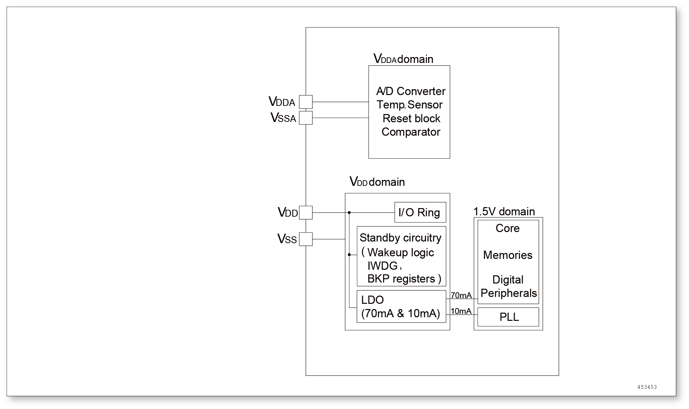
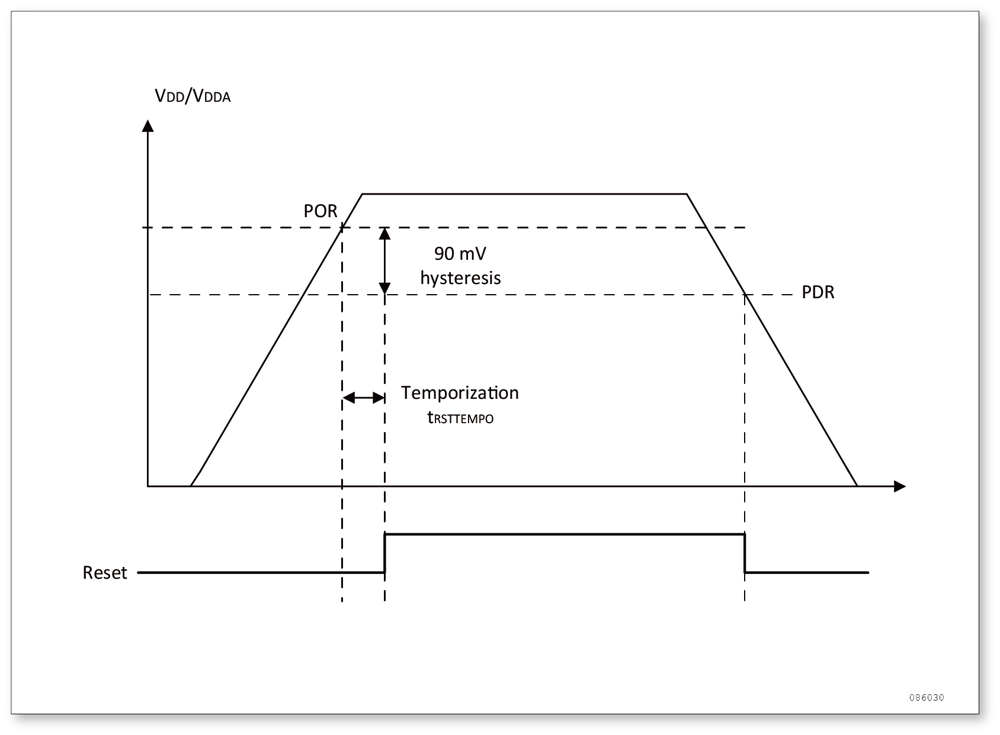
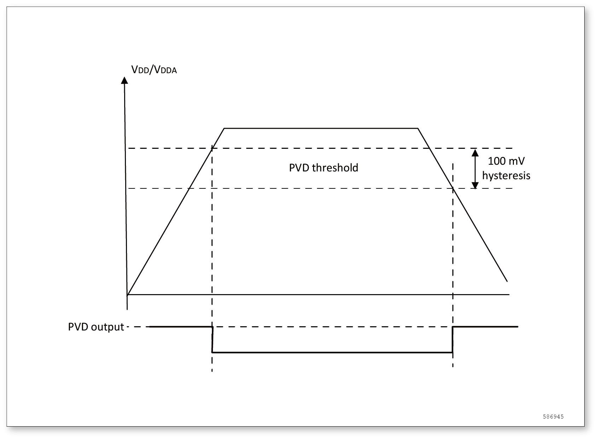

电源控制（PWR）
===============

电源
----

芯片的工作电压 (V\ :sub:`DD`\ ) 为 2.0V ~ 5.5V。通过内置的电压调节器提供所需的 1.5V 电源。

    
    电源框图

.. warning:: V\ :sub:`DDA`\  和 V\ :sub:`SSA`\ 必须分别连到 V\ :sub:`DD`\  和 V\ :sub:`SS`\ 。

独立的 A/D 转换器供电和参考电压
^^^^^^^^^^^^^^^^^^^^^^^^^^^^^^^

为了提高转换的精确度，AD 使用一个独立的电源供电，过滤和屏蔽来自印刷电路板上的毛刺干扰。

- ADC 的电源引脚为 V\ :sub:`DDA`\ 
- 独立的电源地 V\ :sub:`SSA`\ 

如果有 V\ :sub:`REF-`\  引脚 (根据封装而定)，它必须连接到 V\ :sub:`SSA`\ 。

电池备份区域
^^^^^^^^^^^^

 当调节器 1.5V 电压域断电时，可以保存备份寄存器的内容。

电压调节器
^^^^^^^^^^

复位后调节器总是使能的。根据应用方式它以 3 种不同的模式工作。

- 运转模式：调节器以正常功耗模式提供1.5V电源(内核，内存和外设)。
- 停机模式：调节器以低功耗模式提供1.5V电源，以保存寄存器和SRAM的内容。
- 待机模式：调节器停止供电。除了备用电路和备份域外，寄存器和SRAM的内容全部丢失。

电源管理器
----------

上电复位（POR）和掉电复位（PDR）
^^^^^^^^^^^^^^^^^^^^^^^^^^^^^^^^

芯片有一个完整的上电复位 (POR) 和掉电复位 (PDR) 电路，当供电电压达到 1.5V 时系统即能正常工作。

当 V\ :sub:`DD`\ /V\ :sub:`DDA`\  低于指定的限位电压 V\ :sub:`POR`\ V\ :sub:`PDR`\  时，系统保持为复位状态，而无需外部复位电路。关于上电复位和掉电复位的细节请参考数据手册的电气特性部分。

    
    上电复位和掉电复位的波形图

可编程电压监测器 (PVD)
^^^^^^^^^^^^^^^^^^^^^^

用户可以利用 PVD 对 V\ :sub:`DD`\  电压与电源控制寄存器 (PWR_CR) 中的 PLS[3:0] 位进行比较来监控电源，这几位选择监控电压的阀值。

通过设置 PVDE 位来使能 PVD。

电源控制/状态寄存器 (PWR_CSR) 中的 PVDO 标志用来表明 V\ :sub:`DD`\  是高于还是低于 PVD 的电压阀值。该事件在内部连接到外部中断的第 16 线，如果该中断在外部中断寄存器中是使能的，该事件就会产生中断。当V\ :sub:`DD`\  下降到 PVD 阀值以下或当V\ :sub:`DD`\  上升到 PVD 阀值之上时，根据外部中断第 16 线的上升/下降边沿触发设置，就会产生 PVD 中断。例如，这一特性可用于用于执行紧急关闭任务。

    
    PVD 的阈值

低功耗模式
----------

在系统或电源复位以后，微控制器处于运行状态。当 CPU 不需继续运行时，可以利用多种低功耗模式来节省功耗，例如等待某个外部事件时。用户需要根据最低电源消耗、最快速启动时间和可用的唤醒源等条件，选定一个最佳的低功耗模式。

芯片有三种低功耗模式：

- 睡眠模式：CPU 停止，所有外设包括 CPU 的外设，如 NVIC、系统时钟 (SysTick) 等仍在运行。
- 停机模式：所有的时钟都已停止，寄存器和 SRAM 的内容依然保存。
- 待机模式：1.5V 电源关闭，除了备用电路和备份域外，寄存器和 SRAM 的内容全部丢失。

此外，在运行模式下，可以通过以下方式中的一种降低功耗：

- 降低系统时钟
- 关闭 APB 和 AHB 总线上未被使用的外设时钟

+------+----------------------------------------------+-----------------------------------------------------+------------------------------------------+------------------------------------+------------+
| 模式 | 进入                                         | 唤醒                                                | 对 1.5V 区域时钟域的影响                 | 对 V\ :sub: `DD`\ 区域时钟域的影响 | 电压调节器 |
+======+==============================================+=====================================================+==========================================+====================================+============+
| 睡眠 | WFI(Wait for Interrupt)                      | 任一中断                                            | CPU 时钟关，对其他时钟和 ADC 时钟无影响} | 无                                 | 开         |
+------+----------------------------------------------+-----------------------------------------------------+                                          +                                    +            +
|      | WFE(Wait for Event)                          | 唤醒事件                                            |                                          |                                    |            |
+------+----------------------------------------------+-----------------------------------------------------+------------------------------------------+------------------------------------+------------+
| 停机 | SLEEPDEEP = 1、同时开启 WFI 或 WFE           | 任一外部中断(在外部中断寄存器中设置)                | 所有使用1.5V的区域的时钟都已关闭         | PLL、HSI 和 HSE 的振荡器关闭       | 开         |
+------+----------------------------------------------+-----------------------------------------------------+                                          +                                    +------------+
| 待机 | PDDS = 1、SLEEPDEEP = 1、同时开启 WFI 或 WFE | WKUP 引脚的上升沿、NRST 引脚上的外部复位、IWDG 复位 |                                          |                                    | 关         |
+------+----------------------------------------------+-----------------------------------------------------+------------------------------------------+------------------------------------+------------+

降低系统时钟频率
^^^^^^^^^^^^^^^^

在运行模式下，通过对预分频寄存器进行编程，可以降低任意一个系统时钟 (SYSCLK、HCLK、PCLK1、PCLK2) 的速度。进入睡眠模式前，也可以利用预分频器来降低外设的时钟。

外部时钟的控制
^^^^^^^^^^^^^^

在运行模式下，任何时候都可以通过停止为外设和内存提供时钟 (HCLK 和 PCLKx) 来减少功耗。

为了在睡眠模式下更多地减少功耗，可在执行WFI或WFE指令前关闭所有外设的时钟。

通过设置 AHB 外设时钟使能寄存器 (RCC_AHBENR)、APB2 外设时钟使能寄存器 (RCC_APB2ENR) 和 APB1 外设时钟使能寄存器 (RCC_APB1ENR) 来开关各个外设模块的时钟。

睡眠模式
^^^^^^^^

进入睡眠模式
""""""""""""

通过执行 WFI 或 WFE 指令进入睡眠状态。根据 Cortex M0 内核中的系统控制寄存器 SLEEPONEXIT 位的值，有两种选项可用于选择睡眠模式进入机制：

- SLEEP-NOW：如果 SLEEPONEXIT 位被清除，当 WFI 或 WFE 被执行时，微控制器立即进入睡眠模式。
- SLEEP-ON-EXIT：如果 SLEEPONEXIT 位被置位，系统从最低优先级的中断处理程序中退出时，微控制器就立即进入睡眠模式。 

在睡眠模式下，所有的 I/O 引脚都保持它们在运行模式时的状态。

关于如何进入睡眠模式，更多的细节参考下表。

+----------------+----------------------------------------------------------------------+
| SLEEP NOW 模式 | 说明                                                                 |
+================+======================================================================+
| 进入           | 在以下条件执行 WFI(Wait for Interrupt) 或 WFE(Wait for Event) 指令： |
+                +                                                                      +
|                | SLEEPDEEP = 0 且 SLEEPONEXIT = 0                                     |
+                +                                                                      +
|                | 参考 ARMv6-M 架构参考手册 B3.2.7 章节描述。                          |
+----------------+----------------------------------------------------------------------+
| 退出           | 如果执行 WFI 进入睡眠模式，则中断唤醒：参考中断向量表                |
+                +                                                                      +
|                | 如果执行 WFE 进入睡眠模式，则事件唤醒：参考唤醒事件管理              |
+----------------+----------------------------------------------------------------------+
| 唤醒延时       | 无                                                                   |
+----------------+----------------------------------------------------------------------+

停机模式
^^^^^^^^

停机模式是在 CPU 的深睡眠模式基础上结合了外设的时钟控制机制，在停机模式下电压调节器可运行在正常模式。此时在 1.5V 供电区域的的所有时钟都被停止，PLL、HSI 和 HSE 振荡器的功能被禁止，SRAM 和寄存器内容被保留下来。

在停机模式下，所有的I/O引脚都保持它们在运行模式时的状态。

进入停机模式
""""""""""""

可以通过对独立的控制位进行编程，可选择以下功能：

- 独立看门狗 (IWDG)：可通过写入看门狗的键寄存器或硬件选择来启动 IWDG。
- 内部振荡器(LSI 振荡器)：通过控制/状态寄存器 (RCC_CSR) 的 LSION 位来设置。

在停机模式下，如果在进入该模式前 ADC 没有被关闭，那么这些外设仍然消耗电流。通过设置寄存器 ADC_CR2 的 ADON 位可关闭这个外设。其他没有使用的 GPIO 需要设置模拟输入，否则有电流消耗。

退出停机模式
""""""""""""

当一个中断或唤醒事件导致退出停机模式时，HSI 振荡器被选为系统时钟。时钟频率为 HSI 的 6 分频。

当电压调节器处于正常功耗模式下，系统从停机模式退出时，将会有一段额外的启动延时。

+----------------+----------------------------------------------------------------------------------------------------------------------------------------------+
| 停机模式       | 说明                                                                                                                                         |
+================+==============================================================================================================================================+
| 进入           | 在以下条件执行 WFI(Wait for Interrupt) 或 WFE(Wait for Event) 指令：                                                                         |
+                +                                                                                                                                              +
|                | SLEEPDEEP = 1，PWR_CR 中的 PDDS = 0                                                                                                          |
+                +                                                                                                                                              +
|                | .. attention:: 为了进入停机模式，所有的外部中断的请求挂起寄存器 (EXTI_PR) 标志都必须被清除，否则停机模式的进入流程将会被跳过，程序继续运行。 |
+----------------+----------------------------------------------------------------------------------------------------------------------------------------------+
| 退出           | 如果执行 WFI 进入停机模式，则中断唤醒：                                                                                                      |
+                +                                                                                                                                              +
|                | 任一外部中断引线被设置为中断模式 (相应的外部中断向量在 NVIC 中必须使能)。                                                                    |
+                +                                                                                                                                              +
|                | 如果执行 WFE 进入停机模式，则事件唤醒：                                                                                                      |
+                +                                                                                                                                              +
|                | 任一外部中断引线被设置为事件模式。参考唤醒事件管理。                                                                                         |
+----------------+----------------------------------------------------------------------------------------------------------------------------------------------+
| 唤醒延时       | HSI 唤醒延时                                                                                                                                 |
+----------------+----------------------------------------------------------------------------------------------------------------------------------------------+

待机模式
^^^^^^^^

待机模式可实现系统的最低功耗。该模式是在 CPU 深睡眠模式时关闭电压调节器。整个 1.5V 供电区域被断电。PLL、HSI 和 HSE 振荡器也被断电。SRAM 和寄存器内容丢失。只有备份的寄存器和待机电路维持供电。

进入待机模式
""""""""""""

可以通过设置独立的控制位，选择以下待机模式的功能：

- 独立看门狗 (IWDG)：可通过写入看门狗的键寄存器或硬件选择来启动 IWDG。
- 内部振荡器 (LSI 振荡器)：通过控制/状态寄存器 (RCC_CSR) 的 LSION 位来设置。

退出待机模式
""""""""""""

当一个外部复位 (NRST 引脚)、IWDG 复位或 WKUP 引脚上的上升沿，微控制器从待机模式退出。从待机唤醒后，除了：电源控制/状态寄存器 (PWR_CSR)，所有寄存器被复位。

从待机模式唤醒后的代码执行等同于复位后的执行(采样启动模式引脚、读取复位向量等)。电源控制/状态寄存器 (PWR_CSR) 将会指示内核由待机状态退出。

+----------------+----------------------------------------------------------------------------------------------------------------------------------------------+
| 停机模式       | 说明                                                                                                                                         |
+================+==============================================================================================================================================+
| 进入           | 在以下条件执行 WFI(Wait for Interrupt) 或 WFE(Wait for Event) 指令：                                                                         |
+                +                                                                                                                                              +
|                | SLEEPDEEP = 1，PWR_CR 中的 PDDS = 1，PWR_CSR 中的 WUF = 0                                                                                    |
+----------------+----------------------------------------------------------------------------------------------------------------------------------------------+
| 退出           | WKUP 引脚（PA0）上升沿信号                                                                                                                   |
+                +                                                                                                                                              +
|                | nRST 引脚外部复位                                                                                                                            |
+                +                                                                                                                                              +
|                | IWDG 复位                                                                                                                                    |
+----------------+----------------------------------------------------------------------------------------------------------------------------------------------+
| 唤醒延时       | 复位阶段时，电压调节器的启动                                                                                                                 |
+----------------+----------------------------------------------------------------------------------------------------------------------------------------------+

待机模式下的输入/输出端口状态
"""""""""""""""""""""""""""""

在待机模式下，所有的I/O引脚处于高阻态，除了以下的引脚：

- 复位引脚（始终有效）
- 当被设置为防侵入或校准输出时的 TAMPER 引脚
- 被使能的唤醒引脚

调试模式
""""""""

默认情况下，如果在进行调试微处理器时，使微处理器进入停止或待机模式，将失去调试连接。这是因为 CPU 内核失去了时钟。

然而，通过设置 DBGMCU_CR 寄存器中的某些配置位，可以在使用低功耗模式下调试软件。更多的细节请参考：低功耗模式的调试支持。

电源控制寄存器描述
------------------

PWR_CR
^^^^^^

+----------------+----------------------+
| **寄存器**     | CR                   |
+----------------+----------------------+
| **描述**       | PWR control register |
+----------------+----------------------+
| **偏移地址**   | 0x00                 |
+----------------+----------------------+
| **访问权限**   | read-write           |
+----------------+----------------------+
| **复位值**     | 0x0000               |
+----------------+----------------------+

+--------------+-------------------------------+-------------------------+-------------------------------+---------------------+----------------------------------+-----------------------------------+
| **位**       | [9:13]                        | 8                       | 4                             | 3                   | 2                                | 1                                 |
+--------------+-------------------------------+-------------------------+-------------------------------+---------------------+----------------------------------+-----------------------------------+
| **名称**     | PLS                           | DBP                     | PVDE                          | CSBF                | CWUF                             | PDDS                              |
+--------------+-------------------------------+-------------------------+-------------------------------+---------------------+----------------------------------+-----------------------------------+
| **描述**     | PVD level selection           | Domain write protection | Power voltage detector enable | Clear standby flag  | Clear wakeup flag                | Power down deepsleep              |
+              +                               +                         +                               +                     +                                  +                                   +
|              | n: 1.8 + 0.3*n V (n = 0 ~ 10) | 0: 关闭                 | 0: 关闭                       |  0: 无              | 0: 无                            | 0: CPU 进入深度睡眠时进入停机模式 |
+              +                               +                         +                               +                     +                                  +                                   +
|              | 如：n = 2, 1.8 + 0.3*2 = 2.4V | 1: 开启                 | 1: 开启                       |  1: 清除 SBF 待机位 | 1: 两个系统时钟周期后清除 WUF 位 | 1: CPU 进入深度睡眠时进入待机模式 |
+--------------+-------------------------------+-------------------------+-------------------------------+---------------------+----------------------------------+-----------------------------------+

PWR_CSR
^^^^^^^

+----------------+-----------------------------+
| **寄存器**     | CSR                         |
+----------------+-----------------------------+
| **描述**       | PWR control/status register |
+----------------+-----------------------------+
| **偏移地址**   | 0x00                        |
+----------------+-----------------------------+
| **访问权限**   | read-write                  |
+----------------+-----------------------------+
| **复位值**     | 0x0000                      |
+----------------+-----------------------------+

+--------------+-----------------------------------------+----------------------------------------------------------------------------------------------------+----------------------------------------------------------------------------------------------------------------+----------------------------------------------------------------------------------------------------------------+
| **位**       | 8                                       | 2                                                                                                  | 1                                                                                                              | 0                                                                                                              |
+--------------+-----------------------------------------+----------------------------------------------------------------------------------------------------+----------------------------------------------------------------------------------------------------------------+----------------------------------------------------------------------------------------------------------------+
| **名称**     | EWUP                                    | PVDO                                                                                               | SBF                                                                                                            | WUF                                                                                                            |
+--------------+-----------------------------------------+----------------------------------------------------------------------------------------------------+----------------------------------------------------------------------------------------------------------------+----------------------------------------------------------------------------------------------------------------+
| **描述**     | Enable WKUP pin                         | PVD output                                                                                         | Standby flag                                                                                                   | Wakeup flag                                                                                                    |
+              +                                         +                                                                                                    +                                                                                                                +                                                                                                                +
|              | 0: 关闭，引脚为通用I/O                  | 0: V\ :sub: `DD`\/V\ :sub: `DDA`\ 高于由PLS[3：0]选定的 PVD 阀值                                   | 0: 系统不在待机模式                                                                                            | 0: 没有发生唤醒事件                                                                                            |
+              +                                         +                                                                                                    +                                                                                                                +                                                                                                                +
|              | 1: 开启，引脚用于待机模式唤醒           | 1: V\ :sub: `DD`\/V\ :sub: `DDA`\ 低于由PLS[3：0]选定的 PVD 阀值                                   | 1: 系统进入待机模式                                                                                            | 1: 在WKUP引脚上发生唤醒事件或出现 RTC 闹钟事件                                                                 |
+              +                                         +                                                                                                    +                                                                                                                +                                                                                                                +
|              | .. attention:: 在系统复位时清除这一位。 | .. attention:: 在待机模式下 PVD 被停止。因此，待机模式后或复位后，直到设置 PVDE 位之前，该位为 0。 | .. attention:: 该位由硬件设置，并只能由 POR/PDR (上电/掉电复位) 或设置电源控制寄存器 (PWR_CR) 的 CSBF 位清除。 | .. attention:: 该位由硬件设置，并只能由 POR/PDR (上电/掉电复位) 或设置电源控制寄存器 (PWR_CR) 的 CWUF 位清除。 |
+--------------+-----------------------------------------+----------------------------------------------------------------------------------------------------+----------------------------------------------------------------------------------------------------------------+----------------------------------------------------------------------------------------------------------------+
