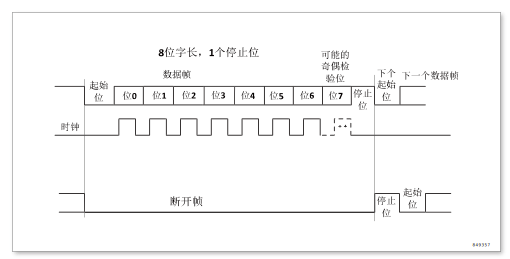
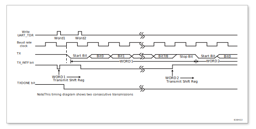

通用异步收发器（UART）
======================

UART 简介
---------

通用异步收发器（UART）提供了一种灵活的方法与使用工业标准 NRZ 异步串行数据格式的外部设备之间进行全双工数据交换。UART 利用分数波特率发生器提供宽范围的波特率选择。它支持同步单向通信和半双工单线通信，以及调制解调器（CTS / RTS）操作。

使用多缓冲器配置的 DMA 方式，可以实现高速数据通信。

UART 主要特征
-------------
* 支持异步方式下 RS-232S 协议，符合工业标准 16550
* 支持 DMA 请求
* 全双工异步操作
* 分数波特率发生器系统
* 发送和接收共用的可编程波特率
* 单独分开的发送和接收缓冲寄存器
* 内置一个字节发送和接收缓冲
* 发送和接收数据低位在前
* 一个起始位开始，后面接数据位，输出的数据长度可为 5 位、6 位、7 位、8 位，最后为停止位。另外可选择是否有加奇偶校验位，奇偶校验位在数据位之后停止位之前。
* 第 9 位可做同步帧配置
* 支持硬件奇数或者偶数校验产生和侦测
* 线断开产生和侦测
* 支持硬件自动流控制
* 支持下面中断源：

    - 发送端BUFFER空
    - 接收端数据有效
    - 接收缓冲缓存溢出
    - 帧错误
    - 奇偶校验错误
    - 接收断开帧
    - 发送移位寄存器完成
    - 发送断开帧完成
    - 接收同步帧

UART 功能概述
-------------
任何 UART 双向通信至少需要两个脚：接收数据输入（RX）和发送数据输出（TX）。
 
RX：接收数据串行输入。通过过采样技术来区别数据和噪音，从而恢复数据。
 
TX：发送数据输出。当发送器被禁止时，输出引脚恢复到它的 I/O 端口配置。当发送器被激活，并且不发送数据时，TX 引脚处于高电平。

* 总线在发送或接收前应处于空闲状态
* 一个起始位
* 一个数据字（5, 6, 7或8位），最低有效位在前
* 1或2个的停止位，由此表明数据帧的结束
* 0.5, 1, 1.5, 2个的停止位，由此表明数据帧的结束
* 使用分数波特率发生器——16位整数和4位小数的表示方法。

下列引脚在硬件流控模式中需要:

* nCTS: 清除发送，若是高电平，在当前数据传输结束时阻断下一次的数据发送。
* nRTS: 发送请求，若是低电平，表明UART准备好接收数据。

    UART 方框图

UART 特性描述
^^^^^^^^^^^^^

字长可以通过编程 UART_CCR 寄存器中的 CHAR 位，选择 5 ~ 8 位。在起始位期间，TX 脚处于低电平，在停止位期间处于高电平。
 
空闲符号被视为完全由 1 组成的一个完整的数据帧，后面跟着包含了数据的下一帧的开始位（1 的位数也包括了停止位的位数）。
 
断开符号被视为在一个帧周期内全部收到 0 （包括停止位期间，也是 0）。在断开帧结束时，发送器再插入 1 或 2 个停止位（1）来应答起始位。
 
发送和接收由一个共用的波特率发生器驱动，当发送器和接收器的使能位分别置位时，分别为其产生时钟。

    UART 时序

发送器
^^^^^^
发送器根据 CHAR 位的状态发送 5 ~ 8 位的数据字。当发送使能位（TXEN）被设置时，发送移位寄存器中的数据在 TX 脚上输出。

字符发送
########
在 UART 发送期间，在 TX 引脚上首先移出数据的最低有效位。在此模式里，UART_TDR 寄存器包含了一个内部总线和发送移位寄存器之间的缓冲器。
 
每个字符之前都有一个低电平的起始位；之后跟着的停止位，其数目可配置。

.. Attention:: 在数据传输期间不能复位 TXEN 位，否则将破坏 TX 脚上的数据，因为波特率计数器停止计数。正在传输的当前数据将丢失。

可配置的停止位
##############
随每个字符发送的停止位的位数可以通过 SPB 位进行编程。
 
断开帧是 10 位低电平，后跟停止位；或者 11 位低电平，后跟停止位。接收到断开帧会置位中断状态寄存器的 RXBRK_INTF 位。

配置步骤
########

#. 通过在 UART_GCR 寄存器上置位 UARTEN 位来激活 UART。
#. 编程 UART_CCR 的 CHAR 位来定义字长。
#. 在 UART_CCR 中 SPB 编程停止位的位数。
#. 设置 UART_GCR 中的 TXEN 位。
#. 利用 UART_BRR 寄存器选择要求的波特率。
#. 把要发送的数据写进 UART_TDR 寄存器（此动作清除 TX_INTF 位）。在只有一个缓冲器的情况下，对每个待发送的数据重复步骤6。

单字节通信
##########

清零 TX_INTF 位总是通过对数据寄存器的写操作来完成的。TX_INTF 位由硬件来设置，它表明：

- 数据已经从 TDR 移送到移位寄存器，数据发送已经开始
- TDR 寄存器被清空
- 下一个数据可以被写进 UART_TDR 寄存器而不会覆盖先前的数据。

如果 TXIEN 位被设置，此标志将产生一个中断。如果此时 UART 正在发送数据，对 UART\_TDR 寄存器的写操作把数据存进 TDR 寄存器，并在当前传输结束时把该数据复制进移位寄存器。

如果此时 UART 没有在发送数据，处于空闲状态，对 UART_TDR 寄存器的写操作直接把数据放进移位寄存器，数据传输开始，TX_INTF 位立即被置起。同时 UART_CSR 的 TXBUF_EMPTY 也会置起。当一帧发送完成时（停止位发送后），同时没有往 UART_TDR 写入新的数据（TDR 寄存器为空），TXC 会置位，表示所有的传输都已经完成。

    发送时状态位变化

断开符号
########
设置 BRK 可发送一个断开符号。如果设置 BRK = 1，在完成当前数据发送后，将在 TX 线上发送一个断开符号。断开字符发送完成时（在断开符号的停止位时）软件必须设置 BRK = 0。UART 在最后一个断开帧的结束处插入一逻辑 1，以保证能识别下一帧的起始位。

接收器
^^^^^^

字符接收
########
在 UART 接收期间，数据的最低有效位首先从 RX 脚移进。在此模式里，UART_RDR 寄存器包含的缓冲器位于内部总线和接收移位寄存器之间。
 
配置步骤：
#. 将 UART_GCR 寄存器的 UARTEN 置 1 来激活 UART。 
#. 编程 UART_CCR 的 CHAR 位定义字长。
#. 在 UART_CCR 中 SPB 编程停止位的位数。
#. 利用 UART_BRR 寄存器选择要求的波特率。
#. 设置 UART_GCR 的 RXEN 位。激活接收器，使它开始寻找起始位。

当一字符被接收到时，
#. RX_INTF 位被置位。它表明移位寄存器的内容被转移到 RDR。换句话说，数据已经被接收并且可以被读出（包括与之有关的错误标志）。
#. 如果 RXIEN 位被设置，产生中断。
#. 在接收期间如果检测到帧错误，或溢出错误，错误标志将被置起。
#. 软件读 UART_RDR 寄存器。RX_INTF 位必须在下一字符接收结束前被清零。

.. Attention:: 在接收数据时，RXEN 位不应该被复位。如果 RXEN 位在接收时被清零，当前字节的接收被丢失。

断开符号
########

当接收到一个断开帧时，UART 会置位 RXBRK_INTF 中断。

溢出错误
########

如果在 UART_RDR 没有读出前又接收到一个字符，则发生溢出错误。

当溢出错误产生时：

- RXOERR\_INTF位被置位。
- RDR内容将不会丢失。读UART\_RDR寄存器仍能得到先前的数据。
- 移位寄存器中以前的内容将被覆盖。随后接收到的数据都将丢失。
- 如果RXOERREN位被设置，中断产生。

帧错误
######
当停止位没有在预期的时间上接收和识别出来时检测到帧错误。当帧错误被检测到时：

- RXFERR_INTF 位被硬件置起。
- 无效数据不会从移位寄存器传送到 UART_RDR 寄存器。
- 如果 RXFERREN 位被设置，中断产生。

9 位数据通信
^^^^^^^^^^^^
如果使能UART\_CCR寄存器的B8EN控制位，UART使能9位数据的发送和接收，可以发送和接收9位数据。注意：在B8EN使能后，奇偶校验使能位PEN不起作用。

数据发送的时候，在写入数据到发送寄存器UART\_TDR前，需要先设置B8TXD。B8TXD作为发送数据的MSB和UART\_TDR的值同时发送。如果设置了B8TOG，如果B8TXD与B8POL相同时，表示该数据作为地址帧或者同步帧，发送结束后B8TXD会自动翻转。在接下来的数据发送过程中，不需要再设置B8TXD为无效电平。

数据接收的时候，接收数据的最高位可以从寄存器位B8RXD读到。如果接收的B8RXD与B8POL相同时，中断状态寄存器UART\_ISR的RXB8\_INTF位会置位。

多处理器通信
^^^^^^^^^^^^

通过UART可以实现多处理器通信(将几个UART连在一个网络里)。例如某个UART设备可以是主，它的TX输出和其他UART从设备的RX输入相连接；UART从设备各自的TX输出逻辑地与在一起，并且和主设备的RX输入相连接。

在多处理器配置中，我们通常希望只有被寻址的接收者才被激活，来接收随后的数据，这样就可以减少由未被寻址的接收器的参与带来的多余的UART服务开销。

未被寻址的设备可启用其静默功能置于静默模式。在静默模式里：

- 任何接收状态位都不会被设置。
- 所有接收中断被禁止。
- UART\_CCR寄存器中的RWU位被置1。RWU可以被硬件自动控制或在某个条件下由软件写入。

根据UART\_CCR寄存器中的WAKE位状态，UART可以用二种方法进入或退出静默模式。

- 如果WAKE位被复位：进行空闲总线检测。
- 如果WAKE位被设置：进行地址标记检测。

空闲总线检测(WAKE=0)
####################
当RWU位被写1时，UART进入静默模式。当检测到一空闲帧时，它被唤醒。然后RWU被硬件清零，中断状态标志RX\_INTF不会置位。RWU还可以被软件写0。\par

地址标记(address mark)检测(WAKE=1)
##################################
在这个模式里，如果MSB是B8POL，该字节被认为是地址，否则被认为是数据。在一个地址字节中，目标接收器的地址被接收器同它自己地址做比较，接收器的地址和屏蔽位被编程在UART\_RXADDR和UART\_RXMASK寄存器中。

如果接收到的字节与它的编程地址不匹配时，UART进入静默模式。此时，硬件设置RWU位。接收该字节既不会设置中断状态标志RX\_INTF也不会产生中断或发出DMA请求，因为UART已经在静默模式。

当接收到的字节与接收器内编程地址匹配时，UART退出静默模式。然后RWU位被清零，随后的字节被正常接收。收到这个匹配的地址字节时将设置中断状态标志RX\_INTF，因为RWU位已被清零。

单线半双工通信
^^^^^^^^^^^^^^
单线半双方模式通过设置UART\_SCR寄存器的HDSEL位选择。在这个模式里，UART\_SCR寄存器的SCEN位必须保持清零状态。\par

UART可以配置成遵循单线半双工协议。在单线半双工模式下，TX和RX引脚在芯片内部互连。使用控制位”HALF DUPLEX SEL”(UART\_SCR中的HDSEL位)选择半双工和全双工通信。\par

当HDSEL为1时\par

- RX不再被使用
- 当没有数据传输时，TX总是被释放。因此，它在空闲状态的或接收状态时表现为一个标准I/O口。这就意味该I/O在不被UART驱动时，必须配置成悬空输入(或开漏的输出高)。

除此以外，通信与正常UART模式类似。由软件来管理线上的冲突(例如通过使用一个中央仲裁器)。特别的是，发送从不会被硬件所阻碍。当TXEN位被设置时，只要数据一写到数据寄存器上，发送就继续。\par

智能卡
^^^^^^
设置UART\_SCR寄存器的SCEN位选择智能卡模式。\par

该接口符合ISO7816-3标准，支持智能卡异步协议。UART应该被设置为：

- 8位数据位加校验位：此时UART\_CCR寄存器中CHAR=11、PEN=1
- 发送和接收时为1.5个停止位：即UART\_CCR寄存器的SPB1=1、SPB0=1

下图给出的例子说明了数据线上，在有校验错误和没校验错误两种情况下的信号。

    UART 方框图

当与智能卡相连接时，UART的TX驱动一根智能卡的双向线。为了做到这点，RX必须和TX连接到相同的I/O口。在发送开始位和数据字节期间，发送器的输出使能位TXEN被置起，在发送停止位期间被释放(弱上拉)，因此在发现校验错误的情况下接收器可以将数据线拉低。如果TXEN不被使用，在停止位期间TX被拉到高电平：这样的话，只要TX配置成开漏，接收器也可以驱动这根线。\par

智能卡是一个单线半双工通信协议\par

- 从发送移位寄存器把数据发送出去，要被延时最小1/2波特时钟。在正常操作时，一个满的发送移位寄存器将在下一个波特时钟沿开始向外移出数据。在智能卡模式里，此发送被延迟1/2波特时钟。
- 如果在接收一个设置为0.5或1.5个停止位的数据帧期间，检测到一奇偶校验错误，在完成接收该帧后(即停止位结束时)，发送线被拉低一个波特时钟周期。这是告诉智能卡发送到UART的数据没有被正确地接收到。此NACK信号(拉低发送线一个波特时钟周期)在发送端将产生一个帧错误(发送端被配置成1.5个停止位)。应用程序可以根据协议处理重新发送数据。如果设置了NACK控制位，发生校验错误时接收器会给出一个NACK信号；否则就不会发送NACK。
- TXC标志的置起可以通过编程保护时间寄存器得以延时。在正常操作时，当发送移位寄存器变空并且没有新的发送请求出现时，TXC被置起。在智能卡模式里，空的发送移位寄存器将触发保护时间计数器开始向上计数，直到保护时间寄存器中的值。TXC在这段时间被强制拉低。当保护时间计数器达到保护时间寄存器中的值时，TXC被置高。
- 标志的撤销不受智能卡模式的影响。
- 如果发送器检测到一个帧错误(收到接收器的NACK信号)，发送器的接收功能模块不会把NACK当作起始位检测。根据ISO协议，接收到的NACK的持续时间可以是1或2波特时钟周期。
- 在接收器这边，如果一个校验错误被检测到，并且NACK被发送，接收器不会把NACK检测成起始位。

.. Attention:: 1. 断开符号在智能卡模式里没有意义。一个带帧错误的00h数据将被当成数据而不是断开符号。
                2. 当来回切换TXEN位时，没有IDLE帧被发送。ISO协议没有定义IDLE帧。\par

下图详述了UART是如何采样NACK信号的。在这个例子里，UART正在发送数据，并且被配置成1.5个停止位。为了检查数据的完整性和NACK信号，UART的接收功能块被激活。

    UART 方框图

分数波特率发生器
^^^^^^^^^^^^^^^^

接收器和发送器的波特率在BRR的整数寄存器和FRA的小数寄存器中的值应设置成相同。

.. math::
    f_{Tx/Rx} = \frac{f_{PCLK}}{16 * UARTDIV}

这里的 :math:`f_{PCLK}` 是给外设的时钟。

UARTDIV是一个无符号的定点数。这16位的值设置在UART\_BRR寄存器。

.. attention:: 在写入UART\_BRR之后，波特率计数器会被波特率寄存器的新值替换。因此，不要在通信进行中改变波特率寄存器的数值。

从 UART\_BRR 寄存器值得到 UARTDIV:\par

例1：如果 DIV\_BRR = 27， DIV\_FRA = 12，于是

Mantissa（BRR）= 27

Fraction（FRA）= 12/16 = 0.75

所以 UARTDIV = 27.75

例2：要求 UARTDIV = 25.62，就有：

DIV\_Fraction = 16 * 0.62 = 9.92

最接近的整数是：10 = 0x0A

DIV\_Mantissa = mantissa（25.620）= 25 = 0x19

于是，UART\_BRR = 0x19

UART\_FRA = 0x0A

例3：要求 UARTDIV = 50.99 就有：

DIV\_Fraction = 16 * 0.99 = 15.84

最接近的整数是：16 = 0x10 =\textgreater FRA[3：0]溢出 =\textgreater  进位必须部分

DIV\_Mantissa = mantissa（50.990 + 进位）= 51 = 0x33

于是：UART\_BRR = 0x33， UART\_FRA = 0x0，UARTDIV = 51

